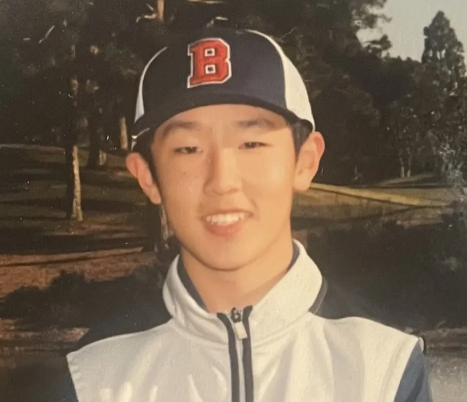

---

### Rishi Gupta

  

  

    

      Snoopy is a lovable beagle and one of the most iconic characters from the Peanuts comic strip, created by Charles M. Schulz. 
    

    <ul style="margin: 0; padding-left: 20px;">
      <li>Loyal companion of Charlie Brown</li>
      <li>Loves root beer and pizza</li>
      <li>Sleeps on top of his doghouse, not inside it</li>
    </ul>
  

---

### Elaine Wang

  

  

    

      Elaine is a rising junior from the Bay Area. She loves to dance, listen to music, and take photos in her free time.
    

    <ul style="margin: 0; padding-left: 20px;">
      <li>Snoopy and fruit lover </li>
      <li>Matcha addict</li>
      <li>Teaches STEM to middle schoolers and volunteers at a food organization in outside of school</li>
    </ul>
  

---

## Allen Jin

  

  

    

      Charlie Brown is ...
    

    <ul style="margin: 0; padding-left: 20px;">
      <li>AAA</li>
      <li>BBB</li>
      <li>CCC</li>
    </ul>
  

  

---

## Saanvi Sheoran

  

  

    

      Saanvi is a rising senior from San Diego.     
    

    <ul style="margin: 0; padding-left: 20px;">
      <li>Enjoys Painting, Drawing</li>
      <li>Interested in Real-World Applications of Data Science and ML</li>
      <li>Volunteers at STEM programs such as All Girls STEM Society and Girls Who Code</li>
    </ul>
  

  

---