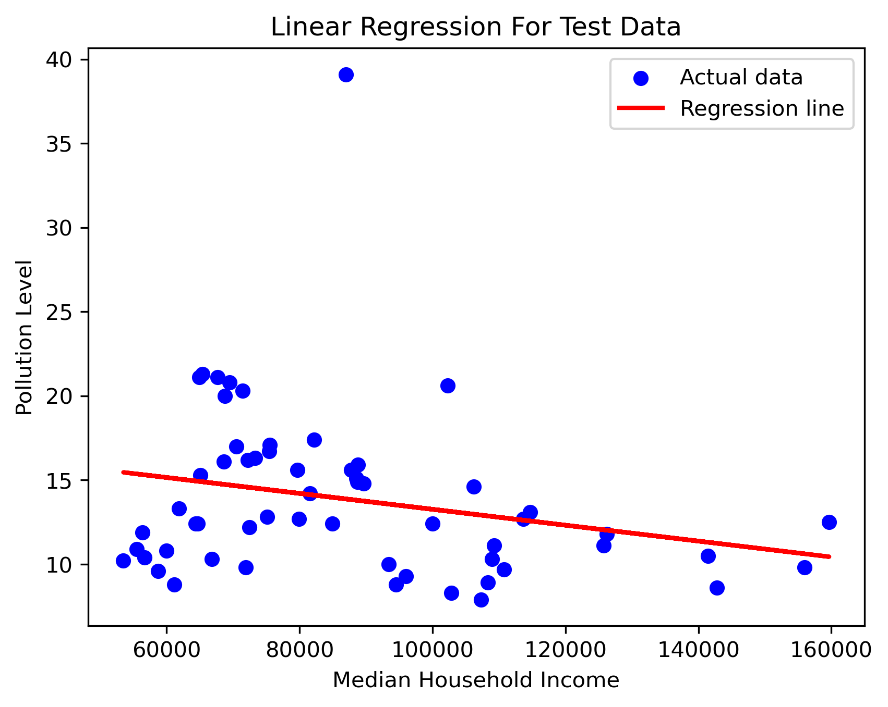

## Objective: Median Household Income vs. Air Quality 
---

## Introduction
Air pollution is a pressing environmental concern in California, with potential links to socioeconomic disparities across counties. This project investigates the relationship between median household income and air pollution levels to explore whether wealthier areas experience lower pollution. By applying a linear regression model, we aim to identify the strength and direction of this correlation using real-world data.

---

## Methodology and Data
We collected data on median household income and air pollution scores for each county in California from the publicly available NIH national database. The data was loaded and cleaned using Python’s Pandas library. To examine the correlation between income and pollution levels, we used Scikit-Learn’s LinearRegression model. The results were then visualized using Matplotlib, where a scatter plot of actual data points was plotted alongside the line of best fit produced by the regression model.

---

## Results
We graphed Median Household Income on the x-axis and Pollution Level on the y-axis. The result for such a graph indicated a series of points along the plot to show an overall downward sloping result. The regression line indicated in the graph below indicates the overall trend. This line reflects the fact that an increase in income typically results in a decrease in the pollution level in that neighborhood.

---

## Discussion
The regression analysis resulted in a negative coefficient (approximately -4.72e-05), suggesting an inverse relationship between income and pollution - as income increases, pollution slightly decreases. However, the R² value of only 0.0576 indicates that median income explains little of the variance in pollution levels. This low R² suggests that the model does not fit the data well and that other factors likely play a much larger role in determining pollution levels. The visual scatter plot supports this conclusion, showing a broad spread of pollution scores regardless of income, with only a slight downward trend in the regression line.

These results suggest that while there may be a slight trend of lower pollution in higher-income counties, income alone is not a strong predictor of air quality. Further research could explore additional variables such as industrial activity, population density, and vehicle traffic to better explain differences in pollution levels across counties.

Some outliers were also noted in the graph with some values deviating greatly from the regression line and were very far apart from the other data points collected.

---

