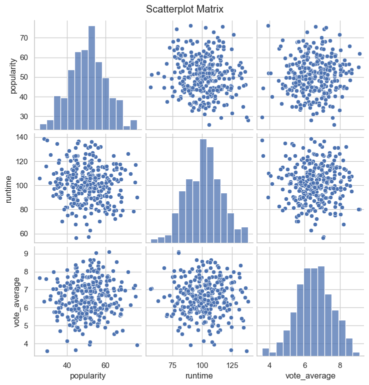
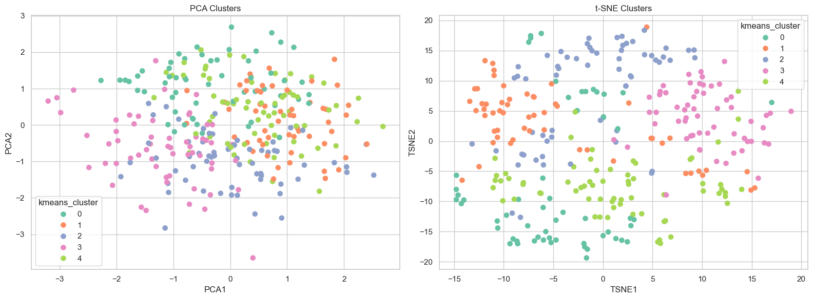
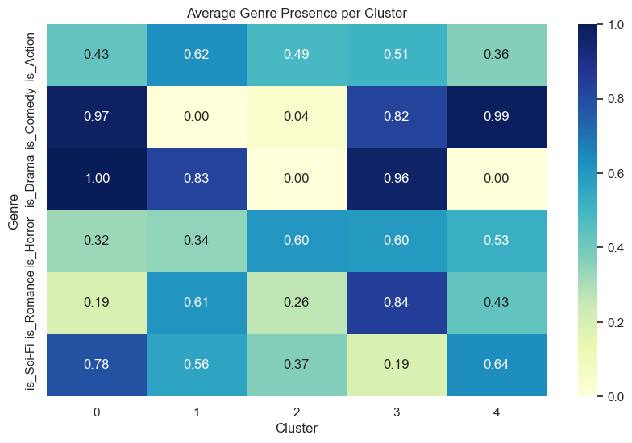

## Objective: Find similarities in movies and cluster them into subgroups
---

## Introduction

There are so many different genres of movies that we watch. Romance. Horror. Comedy. You name it. This project investigates similarities between features of a movie, such as genre, movie length, and popularity in order to group the large amount of movies into clusters that have similar characteristics. Using these similar characteristics, we can make conclusions about each group of movies based on how they were organized.

---

## Methodology and Data
In order to properly classify the dataset of movies, we used a variety of clustering techniques, including PCA and t-SNE to attempt to cluster movies into clusters.

PCA involves rotating the axis of the data in order to fit all data into two dimensions. To put it in simple words, PCA means that a line of best fit for the data becomes the new x-axis in order to make it easier to visualize and separate data. Separating data means being able to identify clusters or clumps of data that belong to a group together. 

t-SNE involves reducing the dimensions of data. Think of all the variables that are possible in movies, such as the popularity, if it is a horror film or not, and if it is a romance film or not. Each one of these characteristics represents one dimension of data, and so there would be a lot of dimensions in our movie dataset. Therefore, we would use t-SNE in order to reduce the dimensions into two dimensions which we are able to visualize and see on a plane. 

There are numerous other types of clustering techniques and different models of these techniques, but we only used t-SNE and PCA as clustering techinques in this project

---

## Results

---

## Discussion
Looking at the above graphs, we notice differences in the results that each type of graph suggests. 
First, let's shift our attention to the scatterplot matrix, labeled "Scatter Plot Matrix". The labels of the graphs are matched by the rows and colums, meaning that the "popularity" score on the upper-left hand side of the matrix suggests that all of the y-axis labels of this row is "popularity". The same thing goes for the other rows and the columns that reflect the labels of the x-axis. Looking at the scatter plots (plots with a bunch of points on them), we notice that there is no significant information we could gain from these graphs. All the data points are clumped up together into one big cluster, which doesn't help us, as we are trying to divide this big blob of data into multiple small groups of data that we can find similar characteristics about to make conclusions. The diagonal line indicates three bar graphs that shows a normal distribution in which the shape of the distribution of the bar plots are like a bell. This is because in these three graphs the x and y axis are the same variables, so it would make sense if they had the same values.

Next, let's look at the colorful PCA and t-SNE clustering we used in the second graph. The different colors represents different clusters that were identified by this clustering technique. Looking at the PCA clusters, we notice that the different colors are somewhat separated in a general direction, but mostly overlap in the center. This is helpful to some degree as we notice that the clustering techinque does find some way to discern clusters, but it doesn't provide enough information for us to find individual clusters. Turning our attention to the t-SNE clustering techinque, we notice immediately that the data points are much more spread out...

---
