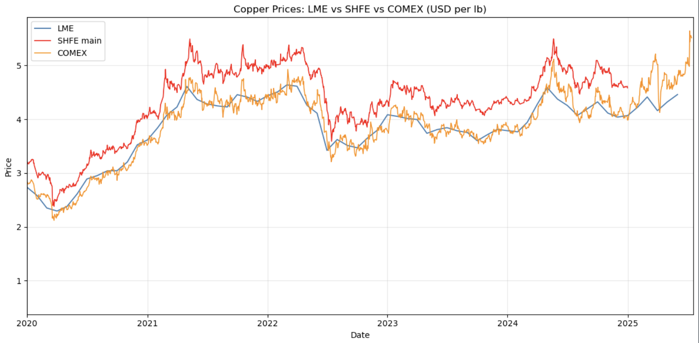
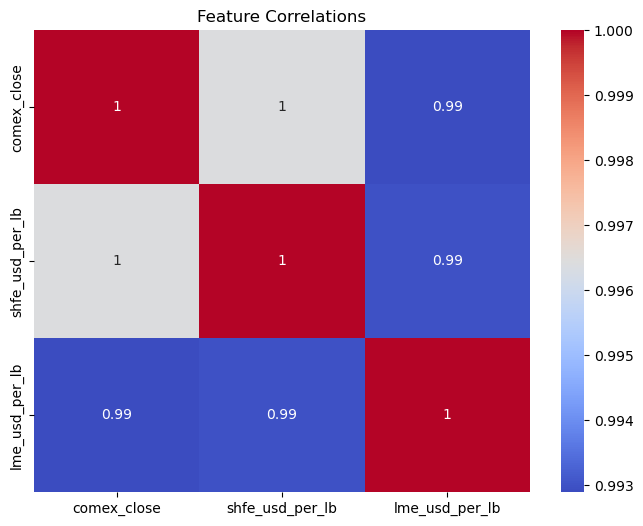
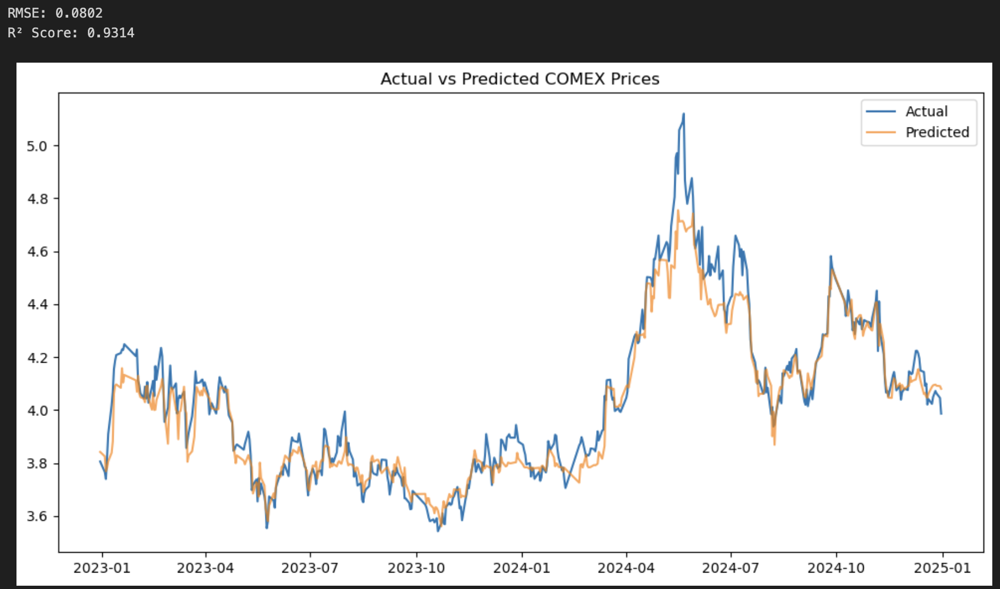

## Objective: Create an AI model to predict Copper prices
---

## Introduction
The copper futures market involves the buying and selling of standardized contracts that obligate the buyer to purchase and the seller to deliver a specified quantity of copper at a predetermined price on a future date. This market allows traders and investors to speculate on the future price of copper without needing to handle the physical commodity itself. There are three of these copper futures markets in the world: Shanghai, Chicago, and London. People buy and sell these contracts based on their prediction of the future prices of these contracts. The question in this mini project is if we can build a model that can predict the price of copper contracts, specifically the one in the United States.

---

## Methodology and Data
In order to collect the data, we downloaded copper contract prices from three exchanges. Below is the visualization of the data:

The graph above shows the fluctuations of the data in relation to time. LME refers to the copper futures market in London. SHFE main refers to the copper futures market in Shanghai. COMEX refers to the copper futures market in Chicago.

We have a collection of scatter plots that shows the relationship between the trends of the copper futures graph of the ones in Shanghai, Chicago, and London. The labels on the left hand side of the matrix correspond to the y-axis labels of each graph that corresponds to its respective row. The labels on the bottom of the matrix correspond to the x-axis labels of each graph that corresponds to its respective column. From the data, we can tell that the trends of the three different copper futures market are almost exactly the same. The line of best fits for the scatter plots follow a linear shape and can easily fit into a straight line.

The graph above shows the a confusion matrix in which we see a matrix of the relationship with different variables. A relationship of 1 means that these two variables are exactly related to each other and than an increment of one of one variable leads to an increment of one of the other variable. It would make sense that the diagonal line marked in red has a relationship of 1 because these three blocks represent a relationship in which the x and y axis are the same variables. Having it as the same variable would mean that each value of one variable would be exactly equal to the other, since we are comparing the variable to itself. We also see that the relationships between other variables are 1, or extremeley close to 1. This means that the trends between these three copper futures market are really close to each other and rarely deviate from each other.

---

## Results
After learning more about the relationships between the three differen copper futures market, we built a Random Forest Model to predict the price of copper contracts. As a quick overview, the Random Forest Model is a model in which the model simultaneously looks at different parts of the data and combines the results of classifying similarlities and characteristics within each random sample of data. With thie model, we generated a prediction of the future values of the copper futures market. Below is our graph with the blue line representing the actual copper futures values and the orange line representing the predictted copper futures values:

---

## Discussion
From the graph of the predicted vs. actual values, we can tell that our model worked quite well and was able to learn the trends of the training data and use it to predict the future values of the copper futures market. The two graphs were very close to each other, with some values a little off. The two values on the top, RMSE and R² Score, represent the differences between these two graphs. RMSE or Root Mean Square Error is obtained by calculating the differences between each points and squaring it. All the squared values are summed up in order to calculate to RMSE. The RMSE was very low, 0.0802 to be precise, meaning that our predicted graph was quite close to what the actual graph looked like. The R² Score represents the variance of the values, a 1 being that the model explains all of the variance in the dependent variable, making the model a reliant one. The R² Score for our model was 0.9314, very close to 1. Thus, our model was able to successfully capture the fluctuations and trend of the data and predict the copper futures market.

---
