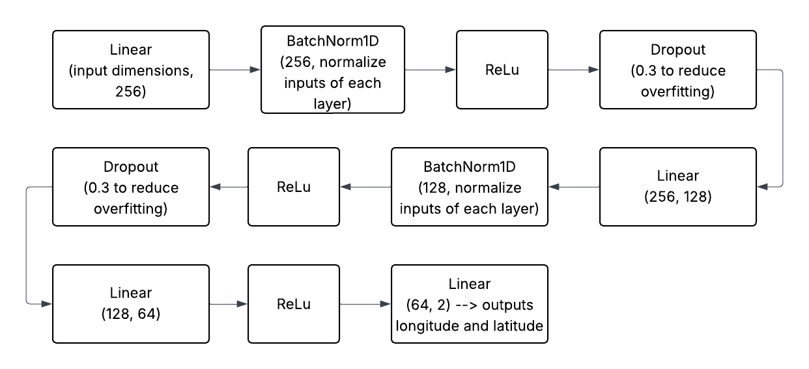

## Introduction

# Impacts of Wildfires

Wildfires are one of the most destructive natural disasters, leaving behind damage to ecosystems, communities, and infrastructure. In recent years, their frequency and intensity have grown, fueled by climate change and shifting environmental conditions. Predicting where wildfires are most likely to occur has become an important challenge in environmental research and disaster management.

# Our Project
In this project, we built a Multilayer Perceptron (MLP) neural network to predict the latitude and longitude of wildfire occurrences. Using features such as historical wildfire records and environmental factors, the model was trained on data prior to 2015 and then tested on fire events from 2015 to evaluate its ability to make accurate predictions. The MLP architecture, which uses multiple layers of connected neurons and RELU activation functions, was designed to capture patterns in the data that simpler models might miss.

To measure performance, we used evaluation metrics such as Mean Squared Error (MSE) and Root Mean Squared Error (RMSE) on the test set. The goal of this project was not only to test how well an MLP can predict wildfire locations but also to better understand the challenges of applying deep learning to real-world environmental data.

---
## Question
1. Can we build an accurate machine model to predict future occurrences of wildfire based on historical data? 
   
2. How can we implement interactive visualization tools to effectively visualize wildfire occurrences over time and allow users to explore spatial patterns in relation to fires and their causes?
   
---
## Data
The dataset we recieved from Kaggle included a wide variety of features, many of which were ID numbers that we can't use, or had missing data for some feature columns. We determined that from the original dataset, the most useful features to include in our model are the following: Fire Cause (Categorical), Fire Size (Float), Fire Class (Categorical), and State (Categorical). 

In addition to the data we were given, we collected weather statistics from NASA Daymet so we also included: Elevation (Float), Precipitation per Day (Float), Max Temperature per day in celsius (float), Vapor Pressure Deficit (Float). 

We believe these factors are important as they can affect the size and effectiveness of the fire. Temperature effects how long the fire can last. Hotter temperatures dries out vegetation, creating more fuel for fires to spread quickly and intensely. Precipitation also greatly affects the intensity of wildfires. Abundant rainfall suppresses fires by moisturizing the fire's potential fuel, which makes it harder for flames to spread.

---
## Methodology
### 1. Processing the Data
We needed to be able to use the data and give it to the model in order for it to learn the trends and relationships betweeen locations and number of wildfires:
- found some useful information in the given dataset such as fire size, fire class, and cause of the fire
- visualized the data using a heat map that indicates the concentration and number of wildfires in the U.S.
### 2. Exploratory Data Analysis 
### 3. Model Development 
The flowchart below indicates the training functions we used in order to train the model. We used a variety of these function layers.

The Linear function combines the inputs and weights and we used it in order give certain input values more importance over others. The BatchNorm1D normalizes the inputs of each layer, meaning it makes the model more efficient and reliable by reducing the possibility of shifts in the distribution of inputs. The ReLu function outputs the input directly if it is positive and outputs zero if the input is negative. This function is non-linear, allowing our model to capture the trends much better than just a best fit line. The Dropout function randomly drops out or disables some neurons (computational units) to create a slightly different inputs for each time we train the model. This helps the model learn trends rather than memorizing data. Memorizing data would cause our prediction of the wildfires in 2015 to be off the true value.
___
## Results

put results here

---

## Discussion
"information about correct and wrong predictions with news and why"

One thing to address is that when we gathered data for the weather by longitude and latitude, we were unable to find data that completely matched the longitude and latitude that we were given. Thus, there is some degree of error (± 0.2) in merging the point location with the weather at that point. 

---
## References
