
## Introduction
---
### Impacts of Wildfires

Wildfires are one of the most destructive natural disasters, leaving behind damage to ecosystems, communities, and infrastructure. In recent years, their frequency and intensity have grown, fueled by climate change and shifting environmental conditions. Predicting where wildfires are most likely to occur has become an important challenge in environmental research and disaster management.

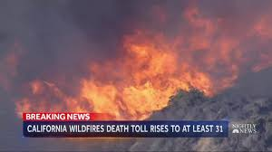

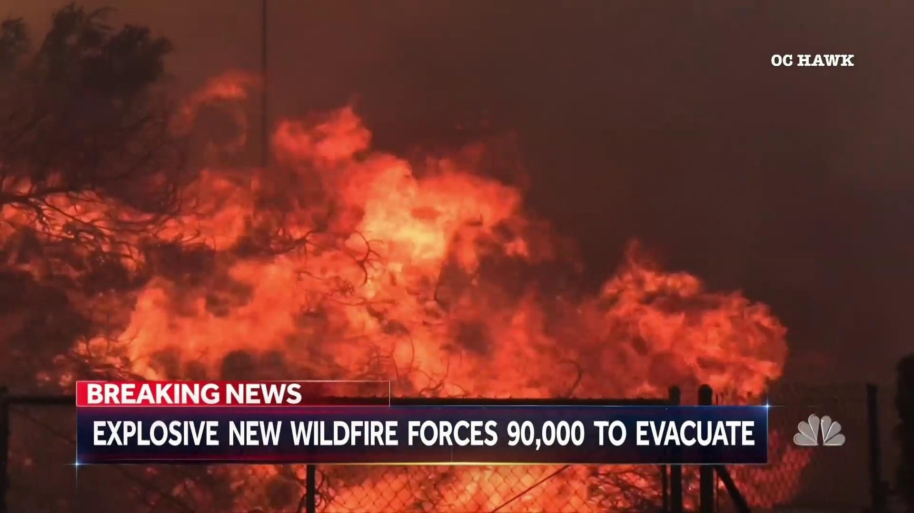

Above are some examples of news reports of wildfires impacting society and the environment. Wildfires are known for their destructive behavior in removing vegetation and causing pollutants in the environment, especially  the air around us. There have been many instances of news reports of the dangers of wildfires on our ecosystems

Thus, in order to prevent the destruction of wildfires on our country, we decided to create a model that would learn from past information and trends about wildfires in order to predict the future locations and amounts of wildfires in an area to be able to procure preventative measures about these wildfires to ensure safety and wellbeing for those living in the area.

### Our Project
In this project, we built a Multilayer Perceptron (MLP) neural network to predict the latitude and longitude of wildfire occurrences. Using features such as historical wildfire records and environmental factors, the model was trained on data prior to 2015 and then tested on fire events from 2015 to evaluate its ability to make accurate predictions. The MLP architecture, which uses multiple layers of connected neurons and RELU activation functions, was designed to capture patterns in the data that simpler models might miss.

To measure performance, we used evaluation metrics such as Mean Squared Error (MSE) and Root Mean Squared Error (RMSE) on the test set. The goal of this project was not only to test how well an MLP can predict wildfire locations but also to better understand the challenges of applying deep learning to real-world environmental data.

---
## Question
1. Can we build an accurate machine model to predict future occurrences of wildfire based on historical data? 
   
2. How can we implement interactive visualization tools to effectively visualize wildfire occurrences over time and allow users to explore spatial patterns in relation to fires and their causes?
   
---
## Data
The dataset we recieved from Kaggle included a wide variety of features, many of which were ID numbers that we can't use, or had missing data for some feature columns. We determined that from the original dataset, the most useful features to include in our model are the following: Fire Cause (Categorical), Fire Size (Float), Fire Class (Categorical), and State (Categorical). 

In addition to the data we were given, we collected weather statistics from NASA Daymet so we also included: Elevation (Float), Precipitation per Day (Float), Max Temperature per day in celsius (float), Vapor Pressure Deficit (Float). 

We believe these factors are important as they can affect the size and effectiveness of the fire. Temperature effects how long the fire can last. Hotter temperatures dries out vegetation, creating more fuel for fires to spread quickly and intensely. Precipitation also greatly affects the intensity of wildfires. Abundant rainfall suppresses fires by moisturizing the fire's potential fuel, which makes it harder for flames to spread.

---
## Methodology
### 1. Data Processing

Before training our neural network, we performed several preprocessing steps to ensure the dataset was clean, consistent, and ready for modeling. The original wildfire dataset contained both categorical and numerical features, as well as some missing values.

    Handling Missing Values
We first checked for missing entries across all features. Numerical columns such as elevation (m), precipitation (mm/day), temperature max (°C), and vapor pressure deficit (Pa) contained a small number of missing values. These were imputed by filling with the median value for that feature. This ensured no rows were dropped, preserving as much data as possible.

	Encoding Categorical Variables

Features such as STAT_CAUSE_DESCR (fire cause description), FIRE_SIZE_CLASS, and STATE were categorical. To make these usable for our neural network, we applied One-Hot Encoding, converting each category into binary indicator columns. This allowed the model to learn from categorical attributes without introducing ordinal bias.

	Feature Scaling
Since our model uses gradient-based optimization, numerical inputs were standardized using a StandardScaler. This transformed each feature to have zero mean and unit variance, preventing features with larger scales (such as elevation in meters) from dominating smaller-scaled features (such as daily precipitation).

	Target Scaling
Our prediction targets, latitude and longitude, were also scaled before training to stabilize learning and reduce loss magnitude. After prediction, results were inverse-transformed back to their real geographic coordinates for evaluation.

	Train-Test Split
To evaluate temporal generalization, we split the dataset by year. All data before 2015 was used for training, while the 2015 data was reserved strictly for testing. This approach simulates a real-world scenario where a model must predict future wildfire locations based on past data.

### 2. Exploratory Data Analysis 
add heat map here and some graphs

Interactive Maps (might take a bit to load)

<a href="https://mybinder.org/v2/gh/AllenJin0818/heatmap/HEAD?urlpath=%2Fvoila%2Frender%2Fapp.ipynb"
   target="_blank"
   rel="noopener noreferrer"
   style="color: #00c3ffff; font-weight: bold; text-decoration: underline; font-size:15px">
   Fire Density Throughout All Years
</a>

<a href="https://mybinder.org/v2/gh/AllenJin0818/heatmap2/HEAD?urlpath=%2Fvoila%2Frender%2Fselectyeardensity.ipynb"
   target="_blank"
   rel="noopener noreferrer"
   style="color: #00c3ffff; font-weight: bold; text-decoration: underline; font-size:15px">
   Fire Density Throughout Select Years
</a>

<a href="https://mybinder.org/v2/gh/AllenJin0818/heatmap3/HEAD?urlpath=%2Fvoila%2Frender%2Ffiresizeallyear.ipynb"
   target="_blank"
   rel="noopener noreferrer"
   style="color: #00c3ffff; font-weight: bold; text-decoration: underline; font-size:15px">
   Fire Size Throughout All Years
</a>

<a href="https://mybinder.org/v2/gh/AllenJin0818/heatmap4/HEAD?urlpath=%2Fvoila%2Frender%2Ffiresizeselectyear.ipynb"
   target="_blank"
   rel="noopener noreferrer"
   style="color: #00c3ffff; font-weight: bold; text-decoration: underline; font-size:15px">
   Fire Size Throughout Select Years
</a>

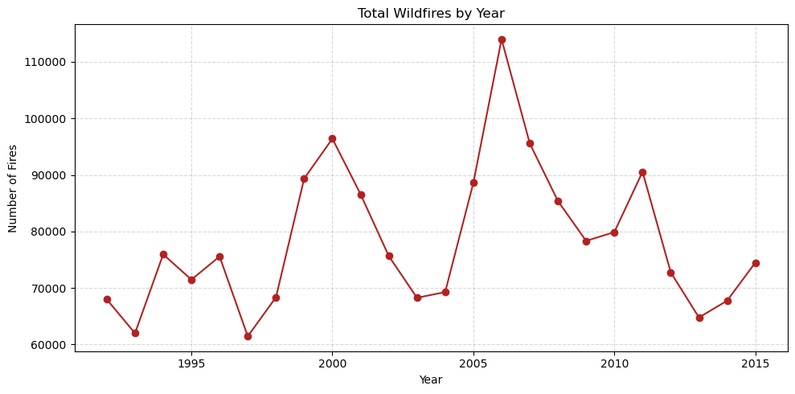
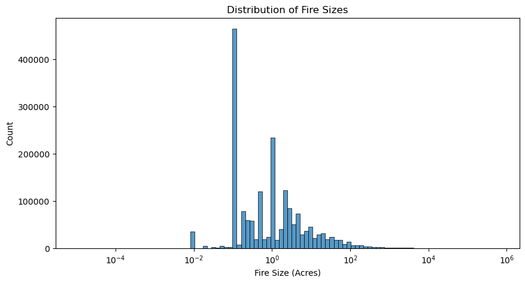
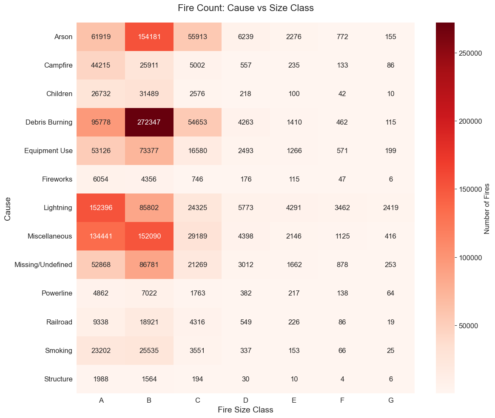
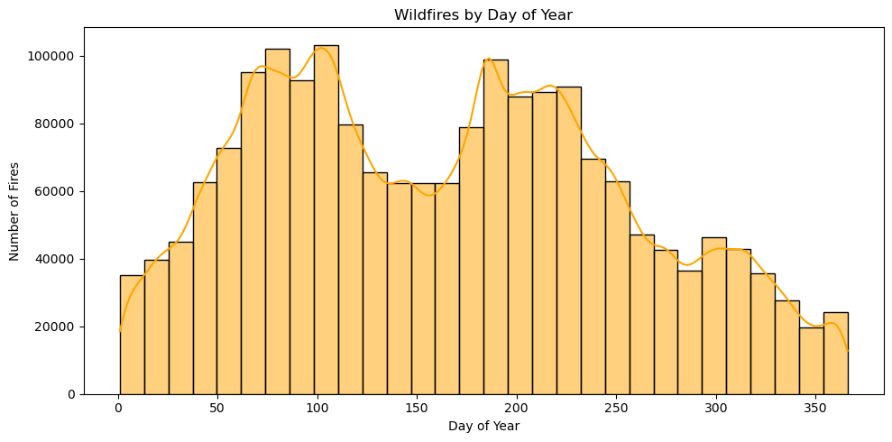
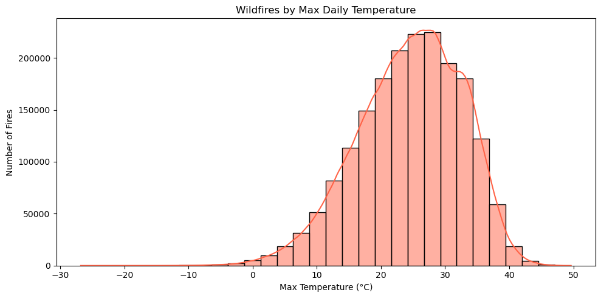
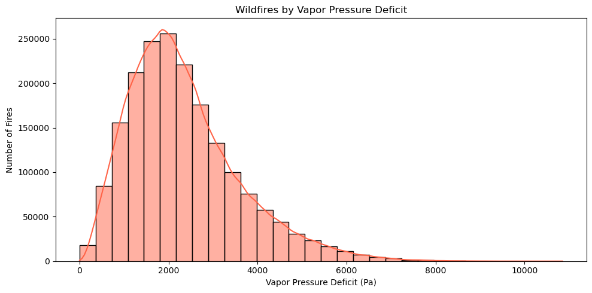
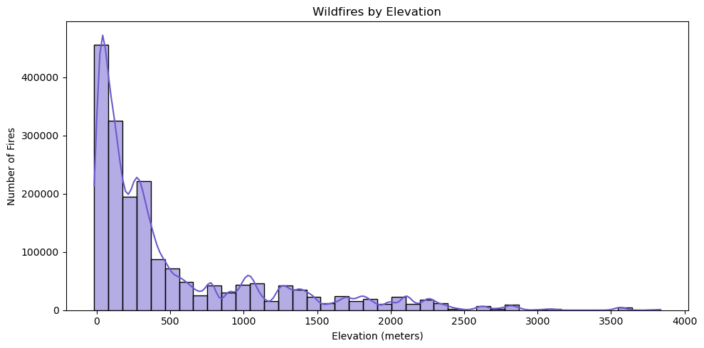
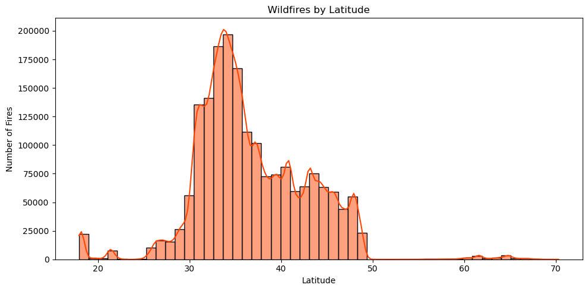
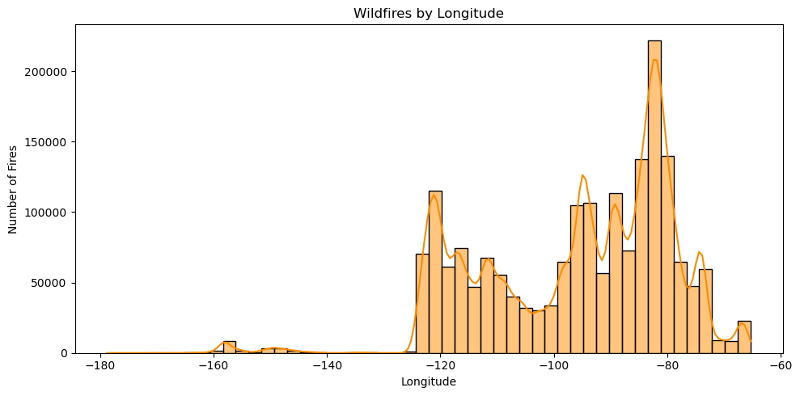

### 3. Model Development 
The flowchart below indicates the architecture of our neural network we used in this project. We used a combination of Linear and Non-Linear layers, and the final output of the model was as tuple predicting latitude and longitude of the wildfires. 

The Linear function combines the inputs and weights and we used it in order give certain input values more importance over others. 

The BatchNorm1D normalizes the inputs of each layer, meaning it makes the model more efficient and reliable by reducing the possibility of shifts in the distribution of inputs. 

The ReLu function outputs the input directly if it is positive and outputs zero if the input is negative. This function is non-linear, allowing our model to capture the trends much better than just a best fit line. 

The Dropout function randomly drops out or disables some neurons (computational units) to create a slightly different inputs for each time we train the model. This helps the model learn trends rather than memorizing data. Memorizing data would cause our prediction of the wildfires in 2015 to be off the true value.
___
## Results

### 1. Model Evaluation 
Our model had a training loss of .1052 after running for 50 epochs. Using this model, we predicted the wildfire trend in the year of 2015 and found the following results:

**Percent Error:**

Mean Latitude Percent Error: 3.7956767

Mean Longitude Percent Error: 3.2202733

\
**Error Calculations:**

Overall MSE: 11.8452

RMSE: 3.4417

MAE: 2.3056

Latitude RMSE: 2.0597

Longitude RMSE: 4.4100

\
**Distance Errors using Kilometers:**
\
We used the haversine python package to calculate the geographical distance between two points given in latitude/longitude coordinates. 

Mean distance error (km): 337.35775307489865

Median distance error (km): 281.007337205663

Max distance error (km): 4431.848336938182

### 2. Comparison of Actual vs. Predicted 2015 Wildfires

Below is a heatmap of the **actual wildfires** that occured across the US in 2015. 
<iframe src="/maps/2015_fires_map_actual.html" width="100%" height="400px" style="border:none;"></iframe>

\
Below is a heatmap of the **predicted wildfires** that occured across the US in 2015.
<iframe src="/maps/2015_fires_map_pred.html" width="100%" height="400px" style="border:none;"></iframe>
---

## Discussion

### About the Errors
Considering the fact that the distance across the U.S. is 4,509 km, the distance errors are small (only 200-300 km off). The government or organization can be able to contain the area of wildfire within this radius using several fire preventative techinques. However, one thing to note is that the max distance error (4431.848336938182 km) is quite close to the distance across the U.S. This means that there are isome predictions that are extremely far off from the actual data. 

One thing to address is that when we gathered data for the weather by longitude and latitude, we were unable to find data that completely matched the longitude and latitude that we were given. Thus, there is some degree of error (± 0.2) in merging the point location with the weather at that point. 

